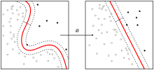

<strong>Machine learning</strong>&nbsp;(<strong>ML</strong>) is the&nbsp;<a title="Branches of science" href="https://en.wikipedia.org/wiki/Branches_of_science">scientific study</a>&nbsp;of&nbsp;<a title="Algorithm" href="https://en.wikipedia.org/wiki/Algorithm">algorithms</a>&nbsp;and&nbsp;<a title="Statistical model" href="https://en.wikipedia.org/wiki/Statistical_model">statistical models</a>&nbsp;that&nbsp;<a class="mw-redirect" title="Computer systems" href="https://en.wikipedia.org/wiki/Computer_systems">computer systems</a>&nbsp;use to perform a specific task without using explicit instructions, relying on patterns and&nbsp;<a title="Inference" href="https://en.wikipedia.org/wiki/Inference">inference</a>&nbsp;instead. It is seen as a subset of&nbsp;<a title="Artificial intelligence" href="https://en.wikipedia.org/wiki/Artificial_intelligence">artificial intelligence</a>. Machine learning algorithms build a&nbsp;<a title="Mathematical model" href="https://en.wikipedia.org/wiki/Mathematical_model">mathematical model</a>&nbsp;based on sample data, known as "<a class="mw-redirect" title="Training data" href="https://en.wikipedia.org/wiki/Training_data">training data</a>", in order to make predictions or decisions without being explicitly programmed to perform the task.&nbsp;Machine learning algorithms are used in a wide variety of applications, such as&nbsp;<a title="Email filtering" href="https://en.wikipedia.org/wiki/Email_filtering">email filtering</a>&nbsp;and&nbsp;<a title="Computer vision" href="https://en.wikipedia.org/wiki/Computer_vision">computer vision</a>, where it is difficult or infeasible to develop a conventional algorithm for effectively performing the task.

Machine learning is closely related to&nbsp;<a title="Computational statistics" href="https://en.wikipedia.org/wiki/Computational_statistics">computational statistics</a>, which focuses on making predictions using computers. The study of&nbsp;<a title="Mathematical optimization" href="https://en.wikipedia.org/wiki/Mathematical_optimization">mathematical optimization</a>&nbsp;delivers methods, theory and application domains to the field of machine learning.&nbsp;<a title="Data mining" href="https://en.wikipedia.org/wiki/Data_mining">Data mining</a>&nbsp;is a field of study within machine learning, and focuses on&nbsp;<a title="Exploratory data analysis" href="https://en.wikipedia.org/wiki/Exploratory_data_analysis">exploratory data analysis</a>&nbsp;through&nbsp;<a title="Unsupervised learning" href="https://en.wikipedia.org/wiki/Unsupervised_learning">unsupervised learning</a>.&nbsp;In its application across business problems, machine learning is also referred to as&nbsp;<a title="Predictive analytics" href="https://en.wikipedia.org/wiki/Predictive_analytics">predictive analytics</a>.

 

<table class="vertical-navbox nowraplinks">
<tbody>
<tr>
<th><a class="mw-selflink selflink">Machine learning</a>&nbsp;and <a title="Data mining" href="https://en.wikipedia.org/wiki/Data_mining">data mining</a></th>
</tr>
<tr>
<td></td>
</tr>
<tr>
<td>

Problems

<ul>
<li><a title="Statistical classification" href="https://en.wikipedia.org/wiki/Statistical_classification">Classification</a></li>
<li><a title="Cluster analysis" href="https://en.wikipedia.org/wiki/Cluster_analysis">Clustering</a></li>
<li><a title="Regression analysis" href="https://en.wikipedia.org/wiki/Regression_analysis">Regression</a></li>
<li><a title="Anomaly detection" href="https://en.wikipedia.org/wiki/Anomaly_detection">Anomaly detection</a></li>
<li><a title="Automated machine learning" href="https://en.wikipedia.org/wiki/Automated_machine_learning">AutoML</a></li>
<li><a title="Association rule learning" href="https://en.wikipedia.org/wiki/Association_rule_learning">Association rules</a></li>
<li><a title="Reinforcement learning" href="https://en.wikipedia.org/wiki/Reinforcement_learning">Reinforcement learning</a></li>
<li><a title="Structured prediction" href="https://en.wikipedia.org/wiki/Structured_prediction">Structured prediction</a></li>
<li><a title="Feature engineering" href="https://en.wikipedia.org/wiki/Feature_engineering">Feature engineering</a></li>
<li><a title="Feature learning" href="https://en.wikipedia.org/wiki/Feature_learning">Feature learning</a></li>
<li><a title="Online machine learning" href="https://en.wikipedia.org/wiki/Online_machine_learning">Online learning</a></li>
<li><a title="Semi-supervised learning" href="https://en.wikipedia.org/wiki/Semi-supervised_learning">Semi-supervised learning</a></li>
<li><a title="Unsupervised learning" href="https://en.wikipedia.org/wiki/Unsupervised_learning">Unsupervised learning</a></li>
<li><a title="Learning to rank" href="https://en.wikipedia.org/wiki/Learning_to_rank">Learning to rank</a></li>
<li><a title="Grammar induction" href="https://en.wikipedia.org/wiki/Grammar_induction">Grammar induction</a></li>
</ul>

</td>
</tr>
<tr>
<td>

<a title="Supervised learning" href="https://en.wikipedia.org/wiki/Supervised_learning">Supervised learning</a> (<strong><a title="Statistical classification" href="https://en.wikipedia.org/wiki/Statistical_classification">classification</a></strong>&nbsp;&bull;&nbsp;<strong><a title="Regression analysis" href="https://en.wikipedia.org/wiki/Regression_analysis">regression</a></strong>)

<ul>
<li><a title="Decision tree learning" href="https://en.wikipedia.org/wiki/Decision_tree_learning">Decision trees</a></li>
<li><a title="Ensemble learning" href="https://en.wikipedia.org/wiki/Ensemble_learning">Ensembles</a>&nbsp;
<ul>
<li><a title="Bootstrap aggregating" href="https://en.wikipedia.org/wiki/Bootstrap_aggregating">Bagging</a></li>
<li><a title="Boosting (machine learning)" href="https://en.wikipedia.org/wiki/Boosting_(machine_learning)">Boosting</a></li>
<li><a title="Random forest" href="https://en.wikipedia.org/wiki/Random_forest">Random forest</a></li>
</ul>
</li>
<li><a title="K-nearest neighbors algorithm" href="https://en.wikipedia.org/wiki/K-nearest_neighbors_algorithm"><em>k</em>-NN</a></li>
<li><a title="Linear regression" href="https://en.wikipedia.org/wiki/Linear_regression">Linear regression</a></li>
<li><a title="Naive Bayes classifier" href="https://en.wikipedia.org/wiki/Naive_Bayes_classifier">Naive Bayes</a></li>
<li><a title="Artificial neural network" href="https://en.wikipedia.org/wiki/Artificial_neural_network">Artificial neural networks</a></li>
<li><a title="Logistic regression" href="https://en.wikipedia.org/wiki/Logistic_regression">Logistic regression</a></li>
<li><a title="Perceptron" href="https://en.wikipedia.org/wiki/Perceptron">Perceptron</a></li>
<li><a title="Relevance vector machine" href="https://en.wikipedia.org/wiki/Relevance_vector_machine">Relevance vector machine (RVM)</a></li>
<li><a title="Support-vector machine" href="https://en.wikipedia.org/wiki/Support-vector_machine">Support vector machine (SVM)</a></li>
</ul>

</td>
</tr>
<tr>
<td>

<a title="Cluster analysis" href="https://en.wikipedia.org/wiki/Cluster_analysis">Clustering</a>

<ul>
<li><a title="BIRCH" href="https://en.wikipedia.org/wiki/BIRCH">BIRCH</a></li>
<li><a class="mw-redirect" title="CURE data clustering algorithm" href="https://en.wikipedia.org/wiki/CURE_data_clustering_algorithm">CURE</a></li>
<li><a title="Hierarchical clustering" href="https://en.wikipedia.org/wiki/Hierarchical_clustering">Hierarchical</a></li>
<li><a title="K-means clustering" href="https://en.wikipedia.org/wiki/K-means_clustering"><em>k</em>-means</a></li>
<li><a title="Expectation&ndash;maximization algorithm" href="https://en.wikipedia.org/wiki/Expectation%E2%80%93maximization_algorithm">Expectation&ndash;maximization (EM)</a></li>
<li><a title="DBSCAN" href="https://en.wikipedia.org/wiki/DBSCAN">DBSCAN</a></li>
<li><a title="OPTICS algorithm" href="https://en.wikipedia.org/wiki/OPTICS_algorithm">OPTICS</a></li>
<li><a class="mw-redirect" title="Mean-shift" href="https://en.wikipedia.org/wiki/Mean-shift">Mean-shift</a></li>
</ul>

</td>
</tr>
<tr>
<td>

<a title="Dimensionality reduction" href="https://en.wikipedia.org/wiki/Dimensionality_reduction">Dimensionality reduction</a>

<ul>
<li><a title="Factor analysis" href="https://en.wikipedia.org/wiki/Factor_analysis">Factor analysis</a></li>
<li><a class="mw-redirect" title="Canonical correlation analysis" href="https://en.wikipedia.org/wiki/Canonical_correlation_analysis">CCA</a></li>
<li><a title="Independent component analysis" href="https://en.wikipedia.org/wiki/Independent_component_analysis">ICA</a></li>
<li><a title="Linear discriminant analysis" href="https://en.wikipedia.org/wiki/Linear_discriminant_analysis">LDA</a></li>
<li><a title="Non-negative matrix factorization" href="https://en.wikipedia.org/wiki/Non-negative_matrix_factorization">NMF</a></li>
<li><a title="Principal component analysis" href="https://en.wikipedia.org/wiki/Principal_component_analysis">PCA</a></li>
<li><a title="T-distributed stochastic neighbor embedding" href="https://en.wikipedia.org/wiki/T-distributed_stochastic_neighbor_embedding">t-SNE</a></li>
</ul>

</td>
</tr>
<tr>
<td>

<a title="Structured prediction" href="https://en.wikipedia.org/wiki/Structured_prediction">Structured prediction</a>

<ul>
<li><a title="Graphical model" href="https://en.wikipedia.org/wiki/Graphical_model">Graphical models</a>&nbsp;
<ul>
<li><a title="Bayesian network" href="https://en.wikipedia.org/wiki/Bayesian_network">Bayes net</a></li>
<li><a title="Conditional random field" href="https://en.wikipedia.org/wiki/Conditional_random_field">Conditional random field</a></li>
<li><a title="Hidden Markov model" href="https://en.wikipedia.org/wiki/Hidden_Markov_model">Hidden Markov</a></li>
</ul>
</li>
</ul>

</td>
</tr>
<tr>
<td>

<a title="Anomaly detection" href="https://en.wikipedia.org/wiki/Anomaly_detection">Anomaly detection</a>

<ul>
<li><a class="mw-redirect" title="K-nearest neighbors classification" href="https://en.wikipedia.org/wiki/K-nearest_neighbors_classification"><em>k</em>-NN</a></li>
<li><a title="Local outlier factor" href="https://en.wikipedia.org/wiki/Local_outlier_factor">Local outlier factor</a></li>
</ul>

</td>
</tr>
<tr>
<td>

<a title="Artificial neural network" href="https://en.wikipedia.org/wiki/Artificial_neural_network">Artificial neural network</a>

<ul>
<li><a title="Autoencoder" href="https://en.wikipedia.org/wiki/Autoencoder">Autoencoder</a></li>
<li><a title="Deep learning" href="https://en.wikipedia.org/wiki/Deep_learning">Deep learning</a></li>
<li><a title="DeepDream" href="https://en.wikipedia.org/wiki/DeepDream">DeepDream</a></li>
<li><a title="Multilayer perceptron" href="https://en.wikipedia.org/wiki/Multilayer_perceptron">Multilayer perceptron</a></li>
<li><a title="Recurrent neural network" href="https://en.wikipedia.org/wiki/Recurrent_neural_network">RNN</a>&nbsp;
<ul>
<li><a title="Long short-term memory" href="https://en.wikipedia.org/wiki/Long_short-term_memory">LSTM</a></li>
<li><a title="Gated recurrent unit" href="https://en.wikipedia.org/wiki/Gated_recurrent_unit">GRU</a></li>
</ul>
</li>
<li><a title="Restricted Boltzmann machine" href="https://en.wikipedia.org/wiki/Restricted_Boltzmann_machine">Restricted Boltzmann machine</a></li>
<li><a title="Generative adversarial network" href="https://en.wikipedia.org/wiki/Generative_adversarial_network">GAN</a></li>
<li><a title="Self-organizing map" href="https://en.wikipedia.org/wiki/Self-organizing_map">SOM</a></li>
<li><a title="Convolutional neural network" href="https://en.wikipedia.org/wiki/Convolutional_neural_network">Convolutional neural network</a>&nbsp;
<ul>
<li><a title="U-Net" href="https://en.wikipedia.org/wiki/U-Net">U-Net</a></li>
</ul>
</li>
</ul>

</td>
</tr>
<tr>
<td>

<a title="Reinforcement learning" href="https://en.wikipedia.org/wiki/Reinforcement_learning">Reinforcement learning</a>

<ul>
<li><a title="Q-learning" href="https://en.wikipedia.org/wiki/Q-learning">Q-learning</a></li>
<li><a title="State&ndash;action&ndash;reward&ndash;state&ndash;action" href="https://en.wikipedia.org/wiki/State%E2%80%93action%E2%80%93reward%E2%80%93state%E2%80%93action">SARSA</a></li>
<li><a title="Temporal difference learning" href="https://en.wikipedia.org/wiki/Temporal_difference_learning">Temporal difference (TD)</a></li>
</ul>

</td>
</tr>
<tr>
<td>

Theory<a id="NavToggle9" class="NavToggle" href="https://en.wikipedia.org/wiki/Machine_learning#">[hide]</a>

<ul>
<li><a class="mw-redirect" title="Bias&ndash;variance dilemma" href="https://en.wikipedia.org/wiki/Bias%E2%80%93variance_dilemma">Bias&ndash;variance dilemma</a></li>
<li><a title="Computational learning theory" href="https://en.wikipedia.org/wiki/Computational_learning_theory">Computational learning theory</a></li>
<li><a title="Empirical risk minimization" href="https://en.wikipedia.org/wiki/Empirical_risk_minimization">Empirical risk minimization</a></li>
<li><a title="Occam learning" href="https://en.wikipedia.org/wiki/Occam_learning">Occam learning</a></li>
<li><a title="Probably approximately correct learning" href="https://en.wikipedia.org/wiki/Probably_approximately_correct_learning">PAC learning</a></li>
<li><a title="Statistical learning theory" href="https://en.wikipedia.org/wiki/Statistical_learning_theory">Statistical learning</a></li>
<li><a title="Vapnik&ndash;Chervonenkis theory" href="https://en.wikipedia.org/wiki/Vapnik%E2%80%93Chervonenkis_theory">VC theory</a></li>
</ul>

</td>
</tr>
<tr>
<td>

Machine-learning venues

<ul>
<li><a title="Conference on Neural Information Processing Systems" href="https://en.wikipedia.org/wiki/Conference_on_Neural_Information_Processing_Systems">NeurIPS</a></li>
<li><a title="International Conference on Machine Learning" href="https://en.wikipedia.org/wiki/International_Conference_on_Machine_Learning">ICML</a></li>
<li><a title="Machine Learning (journal)" href="https://en.wikipedia.org/wiki/Machine_Learning_(journal)">ML</a></li>
<li><a title="Journal of Machine Learning Research" href="https://en.wikipedia.org/wiki/Journal_of_Machine_Learning_Research">JMLR</a></li>
<li><a class="external text" href="https://arxiv.org/list/cs.LG/recent" rel="nofollow">ArXiv:cs.LG</a></li>
</ul>

</td>
</tr>
<tr>
<td>

<a title="Glossary of artificial intelligence" href="https://en.wikipedia.org/wiki/Glossary_of_artificial_intelligence">Glossary of artificial intelligence</a>

<ul>
<li><a title="Glossary of artificial intelligence" href="https://en.wikipedia.org/wiki/Glossary_of_artificial_intelligence">Glossary of artificial intelligence</a></li>
</ul>

</td>
</tr>
<tr>
<td>

Related articles

<ul>
<li><a title="List of datasets for machine-learning research" href="https://en.wikipedia.org/wiki/List_of_datasets_for_machine-learning_research">List of datasets for machine-learning research</a></li>
<li><a title="Outline of machine learning" href="https://en.wikipedia.org/wiki/Outline_of_machine_learning">Outline of machine learning</a></li>
</ul>

</td>
</tr>
</tbody>
</table>

 

<h2 id="mw-toc-heading">Contents</h2>
<label class="toctogglelabel" for="toctogglecheckbox"></label>

<ul>
<li class="toclevel-1 tocsection-1"><a href="#Overview">Overview</a>
<ul>
<li class="toclevel-2 tocsection-2"><a href="#Machine_learning_tasks">Machine learning tasks</a></li>
</ul>
</li>
<li class="toclevel-1 tocsection-3"><a href="#History_and_relationships_to_other_fields">History and relationships to other fields</a>
<ul>
<li class="toclevel-2 tocsection-4"><a href="#Relation_to_data_mining">Relation to data mining</a></li>
<li class="toclevel-2 tocsection-5"><a href="#Relation_to_optimization">Relation to optimization</a></li>
<li class="toclevel-2 tocsection-6"><a href="#Relation_to_statistics">Relation to statistics</a></li>
</ul>
</li>
<li class="toclevel-1 tocsection-7"><a href="#Theory">Theory</a></li>
<li class="toclevel-1 tocsection-8"><a href="#Approaches">Approaches</a>
<ul>
<li class="toclevel-2 tocsection-9"><a href="#Types_of_learning_algorithms">Types of learning algorithms</a>
<ul>
<li class="toclevel-3 tocsection-10"><a href="#Supervised_learning">Supervised learning</a></li>
<li class="toclevel-3 tocsection-11"><a href="#Unsupervised_learning">Unsupervised learning</a></li>
<li class="toclevel-3 tocsection-12"><a href="#Reinforcement_learning">Reinforcement learning</a></li>
<li class="toclevel-3 tocsection-13"><a href="#Self_learning">Self learning</a></li>
<li class="toclevel-3 tocsection-14"><a href="#Feature_learning">Feature learning</a></li>
<li class="toclevel-3 tocsection-15"><a href="#Sparse_dictionary_learning">Sparse dictionary learning</a></li>
<li class="toclevel-3 tocsection-16"><a href="#Anomaly_detection">Anomaly detection</a></li>
<li class="toclevel-3 tocsection-17"><a href="#Association_rules">Association rules</a></li>
</ul>
</li>
<li class="toclevel-2 tocsection-18"><a href="#Models">Models</a>
<ul>
<li class="toclevel-3 tocsection-19"><a href="#Artificial_neural_networks">Artificial neural networks</a></li>
<li class="toclevel-3 tocsection-20"><a href="#Decision_trees">Decision trees</a></li>
<li class="toclevel-3 tocsection-21"><a href="#Support_vector_machines">Support vector machines</a></li>
<li class="toclevel-3 tocsection-22"><a href="#Regression_analysis">Regression analysis</a></li>
<li class="toclevel-3 tocsection-23"><a href="#Bayesian_networks">Bayesian networks</a></li>
<li class="toclevel-3 tocsection-24"><a href="#Genetic_algorithms">Genetic algorithms</a></li>
</ul>
</li>
<li class="toclevel-2 tocsection-25"><a href="#Training_models">Training models</a>
<ul>
<li class="toclevel-3 tocsection-26"><a href="#Federated_learning">Federated learning</a></li>
</ul>
</li>
</ul>
</li>
<li class="toclevel-1 tocsection-27"><a href="#Applications">Applications</a></li>
<li class="toclevel-1 tocsection-28"><a href="#Limitations">Limitations</a>
<ul>
<li class="toclevel-2 tocsection-29"><a href="#Bias">Bias</a></li>
</ul>
</li>
<li class="toclevel-1 tocsection-30"><a href="#Model_assessments">Model assessments</a></li>
<li class="toclevel-1 tocsection-31"><a href="#Ethics">Ethics</a></li>
<li class="toclevel-1 tocsection-32"><a href="#Software">Software</a>
<ul>
<li class="toclevel-2 tocsection-33"><a href="#Free_and_open-source_software">Free and open-source software</a></li>
<li class="toclevel-2 tocsection-34"><a href="#Proprietary_software_with_free_and_open-source_editions">Proprietary software with free and open-source editions</a></li>
<li class="toclevel-2 tocsection-35"><a href="#Proprietary_software">Proprietary software</a></li>
</ul>
</li>
<li class="toclevel-1 tocsection-36"><a href="#Journals">Journals</a></li>
<li class="toclevel-1 tocsection-37"><a href="#Conferences">Conferences</a></li>
</ul>
 

<h2>Overview</h2>

The name&nbsp;<em>machine learning</em>&nbsp;was coined in 1959 by&nbsp;<a title="Arthur Samuel" href="https://en.wikipedia.org/wiki/Arthur_Samuel">Arthur Samuel</a>.<a title="Tom M. Mitchell" href="https://en.wikipedia.org/wiki/Tom_M._Mitchell">Tom M. Mitchell</a>&nbsp;provided a widely quoted, more formal definition of the algorithms studied in the machine learning field: "A computer program is said to learn from experience&nbsp;<em>E</em>&nbsp;with respect to some class of tasks&nbsp;<em>T</em>&nbsp;and performance measure&nbsp;<em>P</em>&nbsp;if its performance at tasks in&nbsp;<em>T</em>, as measured by&nbsp;<em>P</em>, improves with experience&nbsp;<em>E</em>."&nbsp;This definition of the tasks in which machine learning is concerned offers a fundamentally&nbsp;<a title="Operational definition" href="https://en.wikipedia.org/wiki/Operational_definition">operational definition</a>&nbsp;rather than defining the field in cognitive terms. This follows&nbsp;<a title="Alan Turing" href="https://en.wikipedia.org/wiki/Alan_Turing">Alan Turing</a>'s proposal in his paper "<a title="Computing Machinery and Intelligence" href="https://en.wikipedia.org/wiki/Computing_Machinery_and_Intelligence">Computing Machinery and Intelligence</a>", in which the question "Can machines think?" is replaced with the question "Can machines do what we (as thinking entities) can do?".&nbsp;In Turing's proposal the various characteristics that could be possessed by a&nbsp;<em>thinking machine</em>&nbsp;and the various implications in constructing one are exposed.

<h3>Machine learning tasks</h3>

&nbsp;

&nbsp;

A&nbsp;<a class="mw-redirect" title="Support vector machine" href="https://en.wikipedia.org/wiki/Support_vector_machine">support vector machine</a>&nbsp;is a supervised learning model that divides the data into regions separated by a&nbsp;<a title="Linear classifier" href="https://en.wikipedia.org/wiki/Linear_classifier">linear boundary</a>. Here, the linear boundary divides the black circles from the white.

 

Machine learning tasks are classified into several broad categories. In&nbsp;<a title="Supervised learning" href="https://en.wikipedia.org/wiki/Supervised_learning">supervised learning</a>, the algorithm builds a&nbsp;<a title="Mathematical model" href="https://en.wikipedia.org/wiki/Mathematical_model">mathematical model</a>&nbsp;from a set of data that contains both the inputs and the desired outputs. For example, if the task were determining whether an image contained a certain object, the&nbsp;<a class="mw-redirect" title="Training data" href="https://en.wikipedia.org/wiki/Training_data">training data</a>&nbsp;for a supervised learning algorithm would include images with and without that object (the input), and each image would have a label (the output) designating whether it contained the object. In special cases, the input may be only partially available, or restricted to special feedback.&nbsp;<a title="Semi-supervised learning" href="https://en.wikipedia.org/wiki/Semi-supervised_learning">Semi-supervised learning</a>&nbsp;algorithms develop mathematical models from incomplete training data, where a portion of the sample input doesn't have labels.

<a title="Statistical classification" href="https://en.wikipedia.org/wiki/Statistical_classification">Classification</a>&nbsp;algorithms and&nbsp;<a title="Regression analysis" href="https://en.wikipedia.org/wiki/Regression_analysis">regression</a>&nbsp;algorithms are types of supervised learning. Classification algorithms are used when the outputs are restricted to a&nbsp;<a class="mw-redirect" title="Discrete number" href="https://en.wikipedia.org/wiki/Discrete_number">limited set</a>&nbsp;of values. For a classification algorithm that filters emails, the input would be an incoming email, and the output would be the name of the folder in which to file the email. For an algorithm that identifies spam emails, the output would be the prediction of either "<a title="Email spam" href="https://en.wikipedia.org/wiki/Email_spam">spam</a>" or "not spam", represented by the&nbsp;<a title="Boolean data type" href="https://en.wikipedia.org/wiki/Boolean_data_type">Boolean</a>&nbsp;values true and false.&nbsp;<a title="Regression analysis" href="https://en.wikipedia.org/wiki/Regression_analysis">Regression</a>&nbsp;algorithms are named for their continuous outputs, meaning they may have any value within a range. Examples of a continuous value are the temperature, length, or price of an object.

In&nbsp;<a title="Unsupervised learning" href="https://en.wikipedia.org/wiki/Unsupervised_learning">unsupervised learning</a>, the algorithm builds a mathematical model from a set of data that contains only inputs and no desired output labels. Unsupervised learning algorithms are used to find structure in the data, like grouping or&nbsp;<a title="Cluster analysis" href="https://en.wikipedia.org/wiki/Cluster_analysis">clustering</a>&nbsp;of data points. Unsupervised learning can discover patterns in the data, and can group the inputs into categories, as in&nbsp;<a title="Feature learning" href="https://en.wikipedia.org/wiki/Feature_learning">feature learning</a>.&nbsp;<a title="Dimensionality reduction" href="https://en.wikipedia.org/wiki/Dimensionality_reduction">Dimensionality reduction</a>&nbsp;is the process of reducing the number of "<a title="Feature (machine learning)" href="https://en.wikipedia.org/wiki/Feature_(machine_learning)">features</a>", or inputs, in a set of data.

<a title="Active learning (machine learning)" href="https://en.wikipedia.org/wiki/Active_learning_(machine_learning)">Active learning</a>&nbsp;algorithms access the desired outputs (training labels) for a limited set of inputs based on a budget and optimize the choice of inputs for which it will acquire training labels. When used interactively, these can be presented to a human user for labeling.&nbsp;<a title="Reinforcement learning" href="https://en.wikipedia.org/wiki/Reinforcement_learning">Reinforcement learning</a>&nbsp;algorithms are given feedback in the form of positive or negative reinforcement in a dynamic environment and are used in&nbsp;<a class="mw-redirect" title="Autonomous vehicle" href="https://en.wikipedia.org/wiki/Autonomous_vehicle">autonomous vehicles</a>&nbsp;or in learning to play a game against a human opponent. Other specialized algorithms in machine learning include&nbsp;<a class="mw-redirect" title="Topic modeling" href="https://en.wikipedia.org/wiki/Topic_modeling">topic modeling</a>, where the computer program is given a set of&nbsp;<a title="Natural language" href="https://en.wikipedia.org/wiki/Natural_language">natural language</a>&nbsp;documents and finds other documents that cover similar topics. Machine learning algorithms can be used to find the unobservable&nbsp;<a title="Probability density function" href="https://en.wikipedia.org/wiki/Probability_density_function">probability density function</a>&nbsp;in&nbsp;<a title="Density estimation" href="https://en.wikipedia.org/wiki/Density_estimation">density estimation</a>&nbsp;problems.&nbsp;<a title="Meta learning (computer science)" href="https://en.wikipedia.org/wiki/Meta_learning_(computer_science)">Meta learning</a>&nbsp;algorithms learn their own&nbsp;<a title="Inductive bias" href="https://en.wikipedia.org/wiki/Inductive_bias">inductive bias</a>&nbsp;based on previous experience. In&nbsp;<a title="Developmental robotics" href="https://en.wikipedia.org/wiki/Developmental_robotics">developmental robotics</a>,&nbsp;<a title="Robot learning" href="https://en.wikipedia.org/wiki/Robot_learning">robot learning</a>&nbsp;algorithms generate their own sequences of learning experiences, also known as a curriculum, to cumulatively acquire new skills through self-guided exploration and social interaction with humans. These robots use guidance mechanisms such as active learning, maturation, motor synergies, and imitation.

&nbsp;

